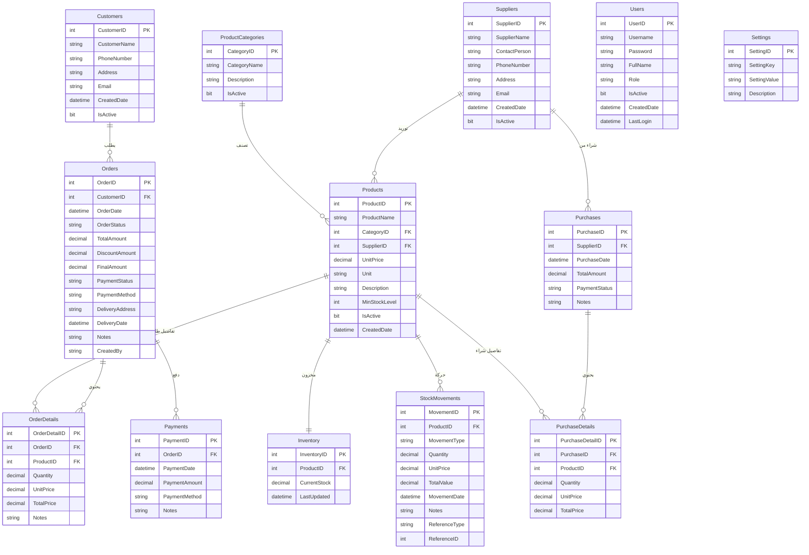

```mermaid
erDiagram
    Customers {
        int CustomerID PK
        string CustomerName
        string PhoneNumber
        string Address
        string Email
        datetime CreatedDate
        bit IsActive
    }
    
    Suppliers {
        int SupplierID PK
        string SupplierName
        string ContactPerson
        string PhoneNumber
        string Address
        string Email
        datetime CreatedDate
        bit IsActive
    }
    
    ProductCategories {
        int CategoryID PK
        string CategoryName
        string Description
        bit IsActive
    }
    
    Products {
        int ProductID PK
        string ProductName
        int CategoryID FK
        int SupplierID FK
        decimal UnitPrice
        string Unit
        string Description
        int MinStockLevel
        bit IsActive
        datetime CreatedDate
    }
    
    Inventory {
        int InventoryID PK
        int ProductID FK
        decimal CurrentStock
        datetime LastUpdated
    }
    
    StockMovements {
        int MovementID PK
        int ProductID FK
        string MovementType
        decimal Quantity
        decimal UnitPrice
        decimal TotalValue
        datetime MovementDate
        string Notes
        string ReferenceType
        int ReferenceID
    }
    
    Orders {
        int OrderID PK
        int CustomerID FK
        datetime OrderDate
        string OrderStatus
        decimal TotalAmount
        decimal DiscountAmount
        decimal FinalAmount
        string PaymentStatus
        string PaymentMethod
        string DeliveryAddress
        datetime DeliveryDate
        string Notes
        string CreatedBy
    }
    
    OrderDetails {
        int OrderDetailID PK
        int OrderID FK
        int ProductID FK
        decimal Quantity
        decimal UnitPrice
        decimal TotalPrice
        string Notes
    }
    
    Payments {
        int PaymentID PK
        int OrderID FK
        datetime PaymentDate
        decimal PaymentAmount
        string PaymentMethod
        string Notes
    }
    
    Purchases {
        int PurchaseID PK
        int SupplierID FK
        datetime PurchaseDate
        decimal TotalAmount
        string PaymentStatus
        string Notes
    }
    
    PurchaseDetails {
        int PurchaseDetailID PK
        int PurchaseID FK
        int ProductID FK
        decimal Quantity
        decimal UnitPrice
        decimal TotalPrice
    }
    
    Users {
        int UserID PK
        string Username
        string Password
        string FullName
        string Role
        bit IsActive
        datetime CreatedDate
        datetime LastLogin
    }
    
    Settings {
        int SettingID PK
        string SettingKey
        string SettingValue
        string Description
    }
    
    %% العلاقات
    ProductCategories ||--o{ Products : "تصنف"
    Suppliers ||--o{ Products : "توريد"
    Products ||--|| Inventory : "مخزون"
    Products ||--o{ StockMovements : "حركة"
    Products ||--o{ OrderDetails : "تفاصيل طلب"
    Products ||--o{ PurchaseDetails : "تفاصيل شراء"
    
    Customers ||--o{ Orders : "يطلب"
    Orders ||--o{ OrderDetails : "يحتوي"
    Orders ||--o{ Payments : "دفع"
    
    Suppliers ||--o{ Purchases : "شراء من"
    Purchases ||--o{ PurchaseDetails : "يحتوي"
```

